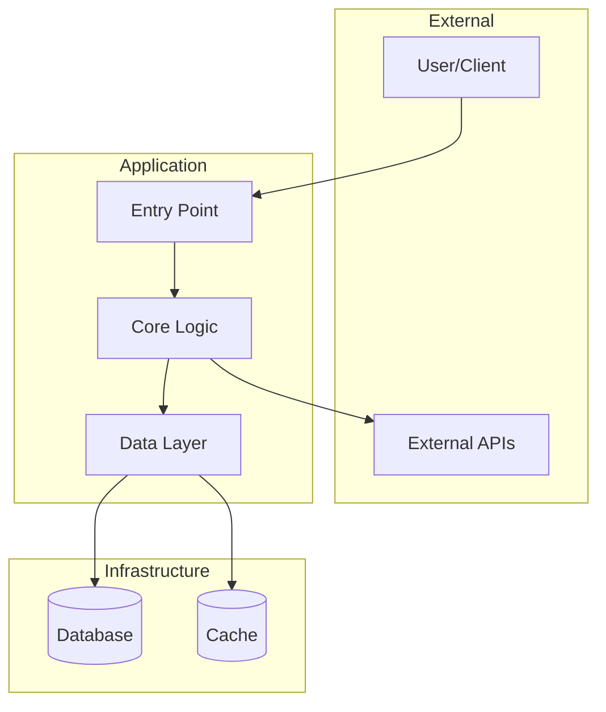
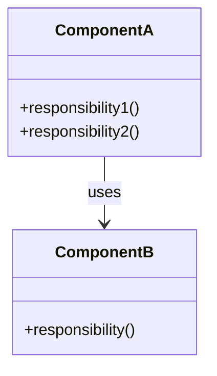
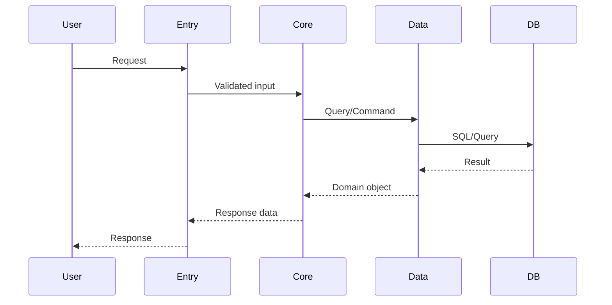
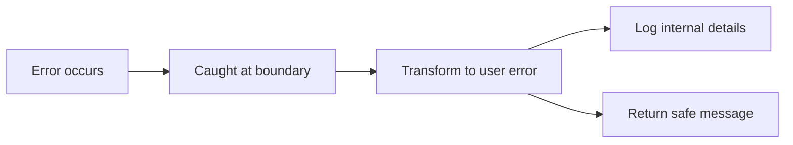
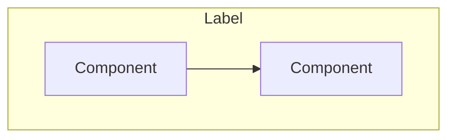
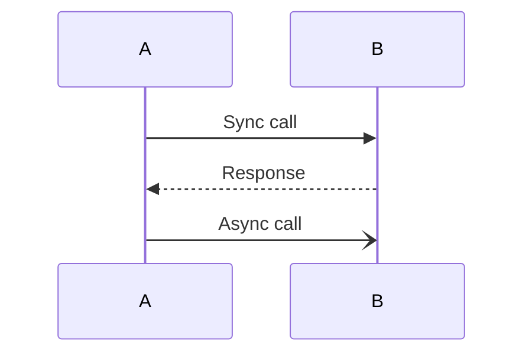
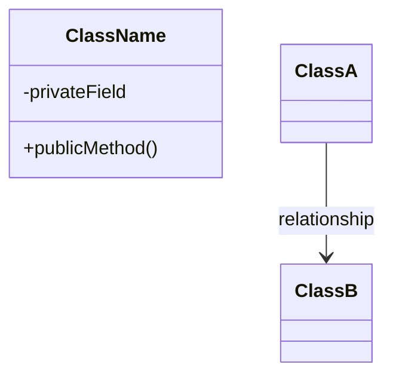
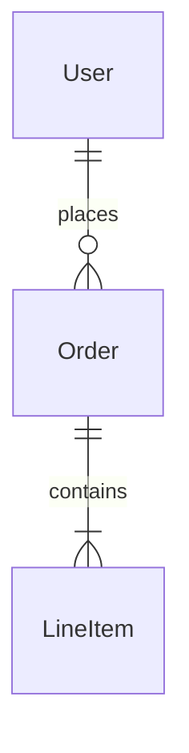

# Architecture Documentation Templates

Templates for generating `docs/architecture/` files. Focus on **why** (decisions, rationale), not **how** (tutorials).

**Key principle**: Architecture docs explain structure, patterns, and rationale. Avoid line-number references that go stale—describe where things live by directory/module, not by line.

## 01-overview.md

```markdown
# System Overview

{1-2 paragraph high-level description of the system, its purpose, and key design goals.}

## Architecture Diagram



## Architecture Style

**Pattern**: {Monorepo / Layered / Modular / Microservices / Monolith}

**Rationale**: {Why this pattern was chosen. What problems it solves. What constraints it addresses.}

## Key Design Decisions

### {Decision 1 Title}

**Context**: {What situation or problem prompted this decision}

**Decision**: {What was decided}

**Rationale**: {Why this approach over alternatives}

**Trade-offs**: {What we gave up or accepted}

### {Decision 2 Title}

{Same structure}

## System Boundaries

| Boundary | Responsibility | Communication |
|----------|----------------|---------------|
| {Name} | {What it owns} | {How it talks to others} |

## Constraints

- {Technical constraint and why it exists}
- {Business constraint and its impact on architecture}
```

## 02-directory-structure.md

```markdown
# Directory Structure

## Layout

```
project-root/
├── src/                    # {Purpose}
│   ├── {folder}/           # {Purpose}
│   └── {folder}/           # {Purpose}
├── tests/                  # {Purpose}
├── docs/                   # Documentation
└── {config files}          # {Purpose}
```

## Design Rationale

### Why This Organization

{Explain the reasoning behind the directory structure. What principles guided the organization.}

### Module Boundaries

| Directory | Responsibility | Dependencies |
|-----------|----------------|--------------|
| `src/{module}` | {Single responsibility} | {What it depends on} |

### Colocation Strategy

{Explain what is colocated and why. E.g., tests next to source, types with implementations, etc.}

## Conventions

- **{Pattern}**: {Where it applies and why}
- **{Pattern}**: {Where it applies and why}

## Anti-patterns to Avoid

- **{Anti-pattern}**: {Why it's problematic in this codebase}
```

## 03-core-components.md

```markdown
# Core Components

## Component Overview



## Components

### {Component Name}

**Responsibility**: {Single sentence describing what this component owns}

**Location**: `src/{path}/`

**Key interfaces**:
- `{InterfaceName}` — {Purpose}

**Dependencies**:
- `{Dependency}` — {Why it depends on this}

**Design rationale**: {Why this component exists as a separate unit. What would break if merged elsewhere.}

### {Next Component}

{Same structure}

## Component Interactions

| From | To | Purpose | Pattern |
|------|----|---------|---------|
| {A} | {B} | {Why A calls B} | {sync/async/event} |

## Ownership Boundaries

{Explain what each component owns exclusively. Clarify shared vs owned resources.}
```

## 04-data-flow.md

```markdown
# Data Flow

## Overview

{1 paragraph describing how data moves through the system at a high level.}

## Primary Flow



## Data Transformations

| Stage | Input | Output | Transformation |
|-------|-------|--------|----------------|
| Entry | Raw request | Validated DTO | Validation, parsing |
| Core | DTO | Domain model | Business rules |
| Data | Domain model | Persistence model | Serialization |

## State Management

### Where State Lives

| State Type | Location | Rationale |
|------------|----------|-----------|
| {Type} | {Where} | {Why here} |

### State Flow Rules

- {Rule about state mutation}
- {Rule about state access}

## Error Flow



## Caching Strategy

{If applicable: what is cached, where, why, and invalidation strategy.}
```

## Mermaid Diagram Patterns

### Flowchart (System Overview)



### Sequence (Data Flow)



### Class (Components)



### ER (Data Models)



## Writing Guidelines

### Do

- Explain **why** decisions were made
- Document **trade-offs** accepted
- Describe **boundaries** and their purpose
- Include **constraints** that shaped the design
- Reference modules/directories (stable) not line numbers (unstable)

### Don't

- Write step-by-step tutorials
- Include implementation details that change frequently
- Repeat information from code comments
- Describe "how to use" (that's onboarding)
- Use line-number references that go stale
